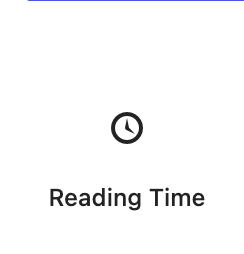
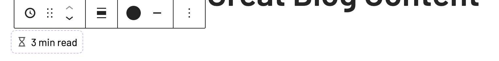
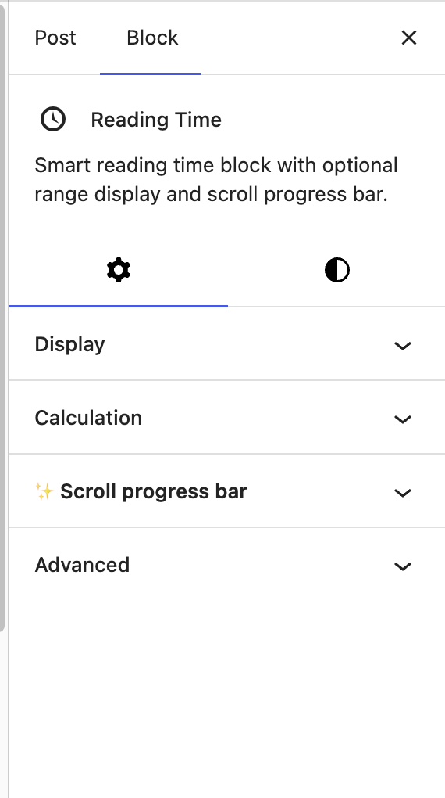
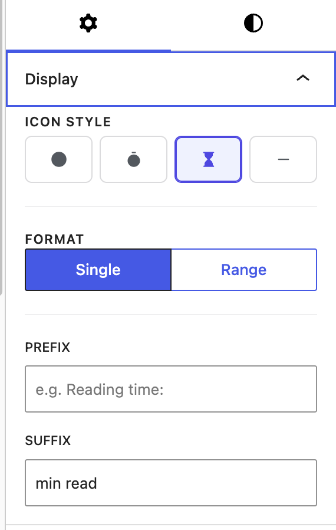
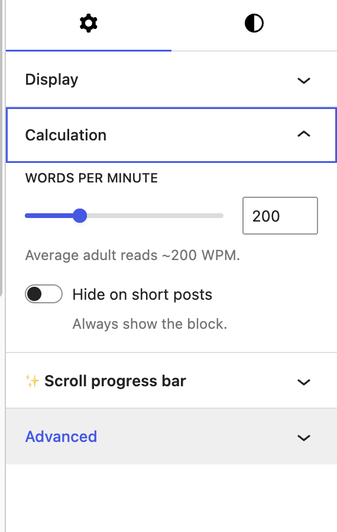
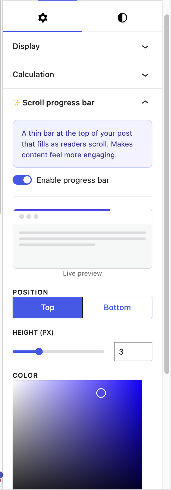
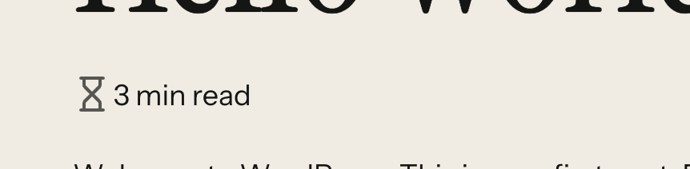

# Idara Reading Time

Show estimated reading time with an optional scroll progress bar. A lightweight, FSE-ready Gutenberg block that loads only where used — no bloat, no tracking.

[](https://wordpress.org/plugins/idara-reading-time/)
[](https://wordpress.org/plugins/idara-reading-time/advanced/)
[](https://wordpress.org/plugins/idara-reading-time/#reviews)
[](https://wordpress.org/plugins/idara-reading-time/)
[](https://www.gnu.org/licenses/gpl-2.0.html)

**WordPress.org:** [wordpress.org/plugins/idara-reading-time](https://wordpress.org/plugins/idara-reading-time/)  
**Version:** 1.0.0 · **Requires WP:** 6.4+ · **Requires PHP:** 7.4+ · **License:** GPL-2.0-or-later

---

## Features

- Estimated reading time, calculated server-side from post content
- Display as a single value (`3 min read`) or a range (`2–3 min read`)
- Adjustable words-per-minute (50–600, default 200)
- 4 icon styles: clock, timer, hourglass, or none
- Optional scroll progress bar — position (top/bottom), height, and color
- Hide on short posts with a configurable minute threshold
- Custom prefix and suffix text
- Inherits theme typography and color via block supports
- Full Site Editing (FSE) compatible — works in templates and template parts
- CSS and JS load **only on pages where the block is present** — never globally
- No tracking, no external requests, no third-party services
- Translation-ready

---

## Screenshots

**Editor / Backend**

| Block inserter | Block in editor | Settings sidebar |
|---|---|---|
|  |  |  |

| Display panel | Calculation panel | Progress bar panel |
|---|---|---|
|  |  |  |

**Frontend**

| Reading time with progress bar | Reading time below post title |
|---|---|
|  |  |

---

## Installation

**From WordPress.org:**

1. Go to **Plugins → Add New** and search for `Idara Reading Time`
2. Click **Install Now**, then **Activate**
3. Open any post or page → click **+** → search **Reading Time** → place the block

**Manual upload:**

1. Download the zip from [WordPress.org](https://wordpress.org/plugins/idara-reading-time/)
2. Go to **Plugins → Add New → Upload Plugin**
3. Upload and activate

---

## Block settings

| Setting | Description |
|---|---|
| Icon style | Clock / Timer / Hourglass / None |
| Format | Single value or Range |
| Words per minute | 50–600 (default 200) |
| Prefix / Suffix | Custom text around the time value |
| Range spread | 1–5 minute window for range mode |
| Progress bar | Off / Top / Bottom |
| Progress bar color | Any CSS color (hex, rgb, hsl, named) |
| Progress bar height | 1–8 px |
| Hide on short posts | Skip display below a minute threshold |

---

## Development

**Requirements:** Node.js 18+, npm

```bash
git clone https://github.com/sajid-ansari-65/idara-reading-time.git
cd idara-reading-time
npm install
```

| Command | Description |
|---|---|
| `npm run start` | Watch `src/` and rebuild on change |
| `npm run build` | Production build → `build/` |
| `npm run plugin-zip` | Generate installable `idara-reading-time.zip` |

**Source → build mapping:**

| Source | Built output | Purpose |
|---|---|---|
| `src/index.js` + `src/edit.js` | `build/index.js` | Editor UI (React, `@wordpress/blocks`) |
| `src/view.js` | `build/view.js` | Frontend scroll bar (vanilla JS, < 1 KB) |
| `src/style.scss` | `build/style-index.css` | Frontend + editor shared styles |
| `src/editor.scss` | `build/index.css` | Editor-only styles |
| `src/render.php` | `build/render.php` | Server-side dynamic render (manually synced — webpack does not copy PHP) |
| `src/block.json` | `build/block.json` | Block metadata |

The `build/` directory is committed so the plugin installs without an npm step. The `src/` directory contains the full human-readable source.

---

## Architecture notes

- **Dynamic block** — reading time is calculated server-side in `render.php` on every request (cached per-request via a static variable). No REST API calls, no JavaScript word counting.
- **`do_blocks()` is intentionally NOT called** on `$post->post_content` — the block is inside that content, which would cause infinite recursion. Block markup is stripped with a regex instead.
- **`viewScript`** in `block.json` — WordPress auto-enqueues `view.js` only on pages that contain the block. No global enqueue.
- **Progress bar + `position: fixed`** — the wrap element is moved to `<body>` at runtime via `document.body.appendChild()` to escape any CSS `transform` or `will-change` ancestors (common in page-builder themes).
- **Color sanitization** — uses a CSS-safe character regex whitelist instead of `sanitize_hex_color()` to support `rgb()`, `hsl()`, and named colors.
- **Icon alignment** — SVG icons use `display: block` and `overflow: visible` to prevent inline-baseline gaps and stroke clipping at viewBox edges. `align-items: center` is explicitly declared on all alignment variants to override WordPress block style injections.

---

## Contributing

Found a bug or have a feature idea? [Open an issue](https://github.com/sajid-ansari-65/idara-reading-time/issues).

All pull requests welcome. Please test against WordPress 6.4+ and a block theme before submitting.

---

## About Idara

**Idara** (إدارة) is an Arabic word meaning "studio" or "administration." It's a small plugin studio building single-purpose, carefully crafted Gutenberg blocks — one problem, one plugin.

[WordPress.org profile](https://profiles.wordpress.org/sajidansari65/)

---

## License

GPL-2.0-or-later — see [LICENSE](https://www.gnu.org/licenses/gpl-2.0.html)
